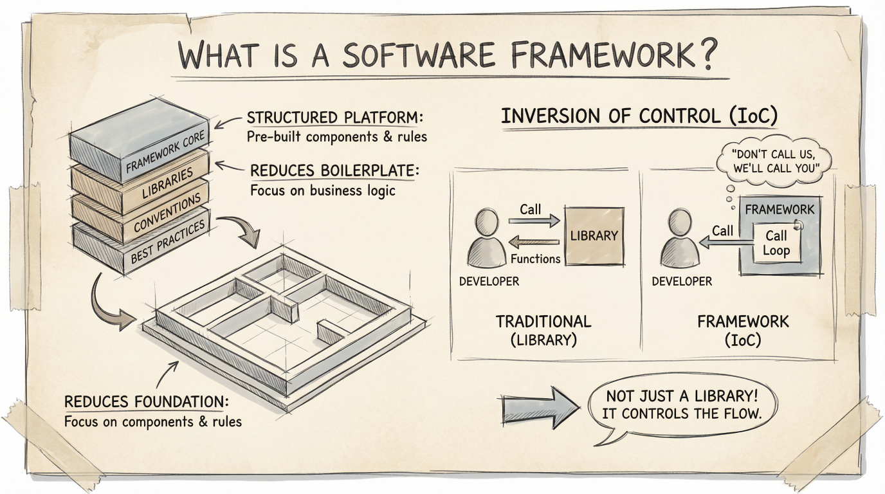
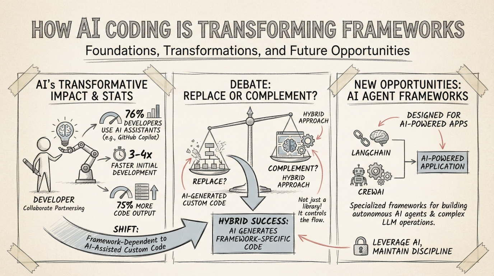
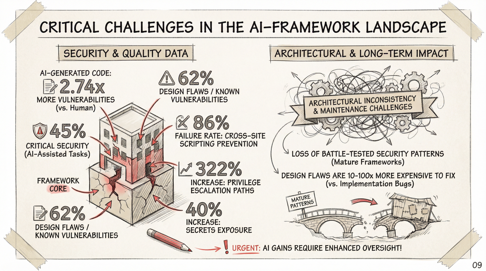
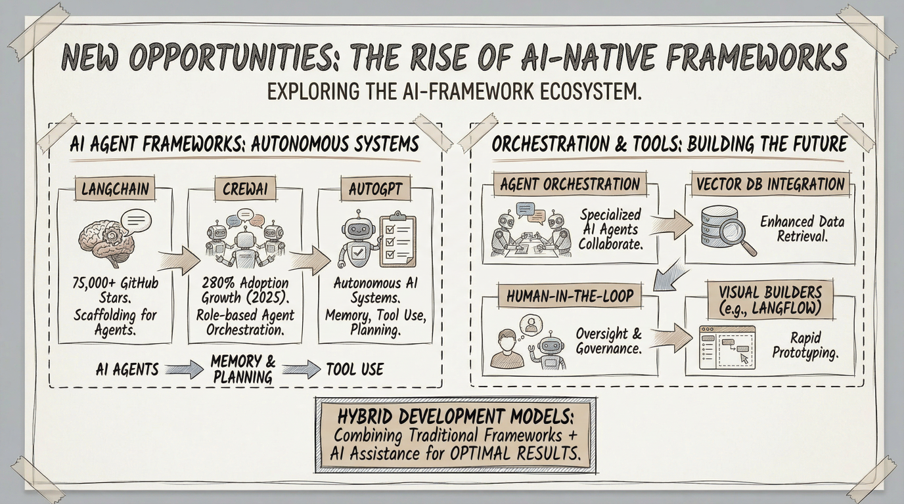
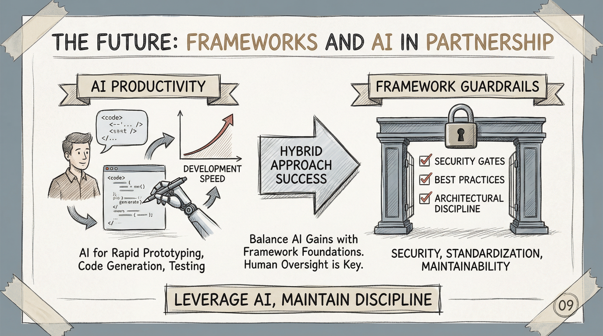

# MoFA, an AI Native Framework for Agent

> GSoC 2026 Call for Proposal — Framework & Infrastructure Track

---

## 1. Introduction and Challenges: Software Frameworks in the AI Era

Before diving into MoFA, we encourage you to review the accompanying presentation: **"Software Frameworks in the AI Era: Foundations, Transformations, and Future Opportunities"** (`Software Frameworks in the AI Era.pptx` in this folder).

### What is a Software Framework?

  

A software framework is not just a library — it controls the flow. Through Inversion of Control (IoC), a framework provides a structured platform of pre-built components and rules, reduces boilerplate, and lets developers focus on business logic. Frameworks have historically served as the backbone of software engineering: standardization, accelerated development, built-in security, scalability, and cross-platform compatibility.

### The AI Transformation

  

We are witnessing a fundamental shift. AI coding assistants (GitHub Copilot, Cursor, Claude Code) are now used by 76% of developers, delivering 3-4x faster initial development and 75% more code output. This raises a critical question:

**Will AI replace frameworks, or complement them?**

The emerging consensus is a **hybrid approach** — AI generates framework-specific code, while frameworks provide the guardrails, architectural discipline, and production-grade reliability that AI-generated code alone cannot guarantee. The shift is from *framework-dependent development* to *AI-assisted custom code within framework boundaries*.

### Critical Challenges

  

The presentation highlights several urgent challenges in the AI-framework landscape:

- **Security & Quality**: AI-generated code contains 2.74x more vulnerabilities than human-written code. 62% of design flaws are known vulnerability patterns. 45% of critical security issues come from AI-assisted tools.
- **Architectural Debt**: 86% of major cross-site scripting patterns in mature frameworks stem from AI-generated code. Design flaws are 3-100x more expensive to fix than implementation bugs.
- **The Oversight Gap**: As AI gains power, enhanced human oversight becomes more urgent, not less.

### The Rise of AI-Native Frameworks

  

A new category is emerging: **AI-native frameworks** — frameworks designed from the ground up for the age of AI agents, not retrofitted from the pre-AI era. The presentation identifies key building blocks:

- **AI Agent Frameworks** (LangChain, CrewAI, AutoGPT) for autonomous systems
- **Agent Orchestration** for AI-enhanced integration
- **Human-in-the-Loop** design for critical oversight
- **Visual Builders** (e.g., Flowise, LangFlow) for rapid prototyping
- **Memory & Planning** as first-class framework concepts
- **Tool Use** as a native capability

The future belongs to **hybrid development models** — combining traditional framework foundations with AI assistance for optimal results. As the presentation concludes: **"Leverage AI, Maintain Discipline."**

  

---

## 2. What Should We Do with MoFA? A Few Leads

MoFA (Modular Framework for Agents) is positioned at the intersection of these challenges. We are building an AI-native framework in Rust — not another wrapper around LLM APIs, but a systems-level foundation for composable, debuggable, production-grade AI agents.

Here are several directions worth exploring. These are **leads, not assignments** — we expect you to think critically about them and propose your own approach.

### Lead A: Redefining "Framework" for Agents

Traditional frameworks assume deterministic code. Agent frameworks must handle **non-deterministic, conversational, multi-step reasoning**. What does Inversion of Control mean when the "user code" is an LLM deciding its next action? How should a framework manage state when an agent's memory is a vector database plus a conversation history? MoFA needs a coherent answer to these questions — not just an API, but a *philosophy* of agent composition.

### Lead B: The Composition Problem in the Vibe Coding Era

When three developers each vibe-code an agent component, who ensures they work together? This is the core problem behind [Idea 1: AgentForge](../../ideas-list.md). But the question goes deeper: What does a *plugin interface* look like for AI agents? Is it typed message schemas? Capability declarations? Something else entirely? We don't have the answer yet.

### Lead C: Security and Quality Gates for AI-Generated Agents

The presentation data is alarming — AI-generated code is significantly more vulnerable. For an agent framework, the stakes are even higher: agents take actions in the real world (API calls, code execution, data access). MoFA needs framework-level security guarantees that go beyond what any individual developer (human or AI) can provide. What does a security model for agent composition look like?

### Lead D: From Framework to Runtime

Most agent frameworks are libraries — they provide building blocks but leave execution to the developer. MoFA is exploring a different path: a **runtime** that manages agent lifecycle, resource allocation, scheduling, and monitoring. The [Edge Model Orchestrator (Idea 3)](../../ideas-list.md) and [Session Recorder (Idea 4)](../../ideas-list.md) are concrete instances of this vision. But the broader question remains: what should an agent runtime provide?

### Lead E: The Developer Experience Gap

Building agents today is painful. Debugging multi-agent interactions is nearly impossible with printf. Understanding why an agent made a particular decision requires tracing through opaque LLM calls. MoFA should make agent development as productive as web development with React DevTools. What does that look like concretely?

---

## 3. Call for Proposal

We are looking for GSoC contributors who want to think deeply about these problems — not just write code.

### What We Value

- **Research and critical thinking.** Read papers. Study how other frameworks (LangGraph, CrewAI, AutoGen) solve these problems. Identify what works and what doesn't. Form your own opinions.
- **Experimentation.** Build prototypes. Try approaches that might fail. A well-documented failed experiment is more valuable than a shallow success.
- **Honest assessment.** If you think MoFA's current approach is wrong, say so. We'd rather hear a well-reasoned critique than polite agreement.
- **First-principles reasoning.** Don't assume the current architecture is correct. Ask "why" before asking "how."

### What We Don't Want

- Proposals that are just a list of PRs to submit. Code is important, but it should follow from understanding, not precede it.
- Surface-level comparisons ("MoFA is better than X because..."). We want depth.
- Proposals that avoid taking a position. We want to see your thinking, even if it's incomplete.

### How to Get Started

1. **Read the presentations** in this folder and the `why-mofa/` folder. Understand the landscape.
2. **Clone and build MoFA** ([mofa](https://github.com/mofa-org/mofa) and [mofa-studio](https://github.com/mofa-org/mofa-studio)). Run the examples. Form first impressions.
3. **Pick a lead** from Section 2 (or define your own). Do a deep dive — read related work, prototype ideas, write up your findings.
4. **Engage with the community.** Join [Discord](https://discord.gg/hKJZzDMMm9), open issues, ask hard questions.
5. **Write a proposal** that reflects your thinking. See the [proposal template](../../proposal-template.md) for structure.

### Remember

GSoC is a learning experience. We are a project in transition — rewriting our core in Rust, exploring new architectures, and figuring things out alongside our contributors. The best proposals will come from people who are genuinely curious about the hard problems in AI agent frameworks, not from people who just want a line on their resume.

We look forward to reading your ideas.

---

*MoFA is an open-source project under the MIT/Apache-2.0 license.*
*Organization contact: dev@mofa.ai | Discord: https://discord.gg/hKJZzDMMm9*
