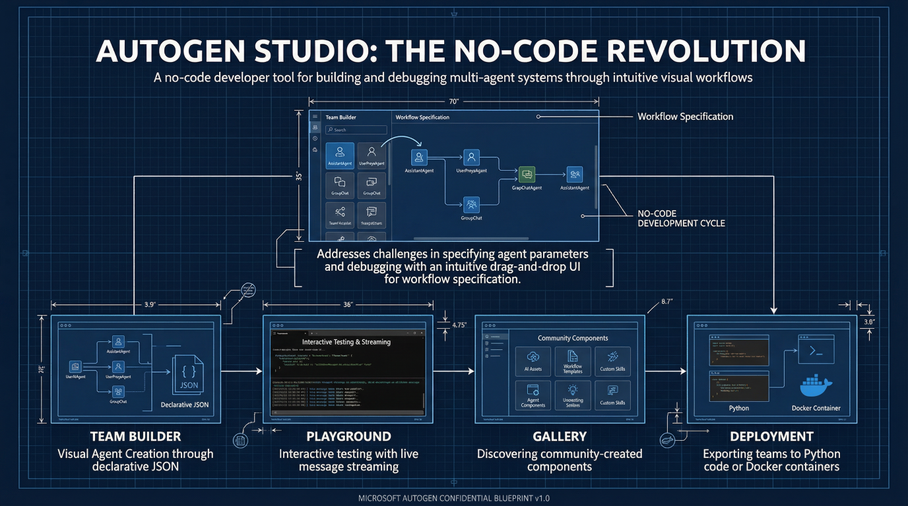
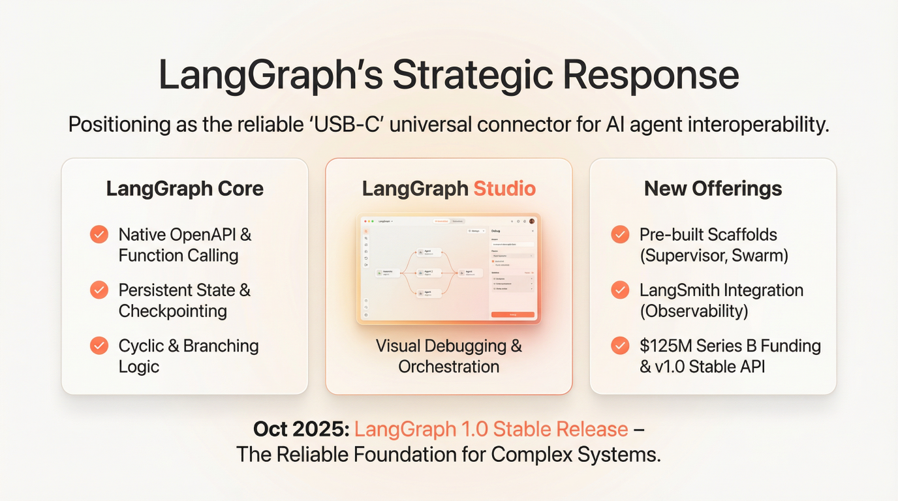
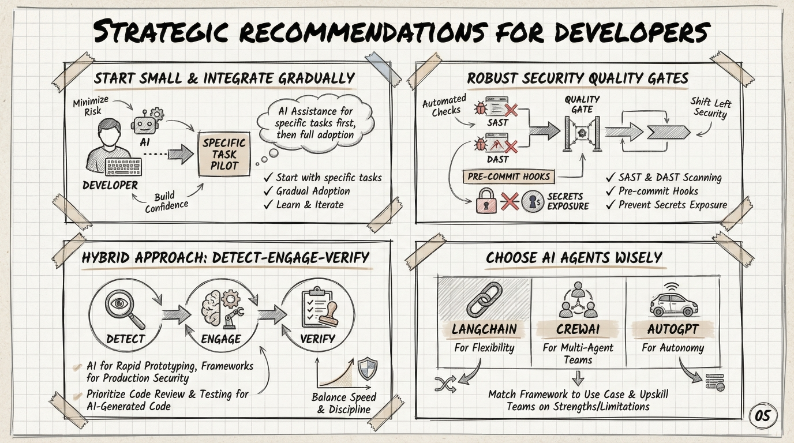

# MoFA 的人机交互：面向 AI 原生 Agent 框架

> GSoC 2026 提案征集 — 人机交互方向

---

这是一个刻意开放的话题。我们没有所有答案——这正是意义所在。

随着 AI Agent 变得越来越强大，最难解决的问题不是"如何让 Agent 更聪明"，而是**"人类和 Agent 应该如何协作？"** MoFA 是一个用 Rust 构建的 AI 原生 Agent 框架。但一个框架的实用性，最终取决于它为使用、监管和依赖它的人类所提供的体验。

本 CFP 邀请你深入思考 AI Agent 框架面临的人机交互挑战——并为 MoFA 应该如何应对提出具体的想法。

---

## 核心张力

AI Agent 框架处于一个独特的位置：它在**人类开发者**和**日益强大的 AI**之间起中介作用。这产生了一个根本性的张力：

- **控制太多**，开发者就成了瓶颈——手动审批每个 Agent 动作、费力配置每个工作流步骤，违背了自治 Agent 的初衷。
- **控制太少**，开发者就失去了理解——Agent 执行开发者无法预测、调试或向利益相关者解释的操作。信任被侵蚀。

MoFA 界面层的每一个设计决策，都是对这条线划在哪里的一次表态。我们邀请你帮助我们找到正确的平衡。

---

## 我们希望你探索的开放问题

### 1. 人在回路：超越审批按钮

  

当前的人在回路方式很粗糙：暂停执行，向开发者展示 Agent 想做什么，等待"批准"或"拒绝"。这无法规模化。

值得研究的问题：
- 一个 10-Agent 管道每小时处理 1,000 个请求时，人在回路应该是什么样的？你不可能逐一手动审批。
- 我们能否设计**基于策略的监管**——由人类定义规则（"未经我的批准不得发送邮件"、"自动批准数据库读取但标记写入"），由框架强制执行？
- 如何处理**渐进式自治**——Agent 在证明可靠性后获得更多自由？这个 UX 应该是什么样的？
- 当 Agent 不确定时，它应该如何求助？一条聊天消息？一个结构化表单？一个 diff 视图？如何设计一个既信息丰富又不令人手足无措的中断？

### 2. 调试与监控：让不可见变为可见

多 Agent 系统是不透明的。消息在 Agent 之间流动，状态在变化，LLM 基于开发者看不到的上下文窗口做出决策。传统调试工具（断点、堆栈追踪、日志文件）是为确定性的、单线程的程序设计的。

值得研究的问题：
- **非确定性系统的调试器**应该是什么样的？Agent 不遵循调用栈——它们遵循对话。如何将其可视化？
- 我们能否构建**"为什么会这样？"**工具——给定一个 Agent 的行为，追溯消息历史、上下文窗口和决策点，解释*为什么*？
- **开发环境**（我正在构建一个 Agent，它出了问题）和**生产环境**（我有 50 个 Agent 在运行，需要知道是否有任何异常）的监控应该有何不同？
- 我们能从现有监控范式中学到什么（Grafana 用于基础设施、Chrome DevTools 用于 Web、Xcode Instruments 用于移动端），Agent 监控有什么根本不同之处？
- 如何监控**概率性**的东西？一个 Agent 每次可能给出略有不同的答案。什么时候"不同"变成了"错误"？

### 3. CLI、TUI、GUI 和跨媒体界面

以下是现有框架在 Studio/IDE 体验上的不同方案——各有取舍：

  

  

  

MoFA 是一个框架，而不是单一应用。开发者将通过多种界面与之交互：

- **CLI**（`mofa-cli`）：用于脚本编写、自动化、CI/CD 管道、快速命令
- **TUI**（终端 UI）：面向生活在终端中但需要比纯文本更丰富可视化的开发者
- **GUI**（MoFA Studio）：用于可视化工作流构建、拖拽式 Agent 组合、实时仪表盘
- **跨媒体**：语音界面、浏览器扩展、IDE 插件、移动端伴侣应用

值得研究的问题：
- 信息应该如何在这些界面之间分配？CLI 应该是 GUI 的简化版，还是每个界面应该有根本不同的交互模型？
- 每个界面的**正确抽象级别**是什么？CLI 用户以命令和管道思考。GUI 用户以可视化流程思考。IDE 用户以代码加可视化辅助思考。同一个底层框架如何同时服务这三者？
- 如何确保各界面之间的**一致性**，而不被迫采用最低公分母的体验？
- 我们能从做得好的工具中学到什么？（如 Docker CLI + Docker Desktop、kubectl + Lens、git CLI + GitKraken）
- **对话式界面**是否有一席之地——用自然语言与 MoFA 本身交互？`mofa chat "帮我构建一个监控邮件的 Agent"` 会是什么样的？

### 4. 框架在人类与 AI 之间的角色

  

这是上述所有问题背后的元问题。

LangGraph、CrewAI 和 AutoGen 等 Agent 框架在很大程度上聚焦于 **AI 侧**——如何让 Agent 更强大、如何编排复杂工作流、如何集成更多工具。人类侧的界面一直是事后补充：一个 YAML 配置文件、一段 Python 脚本，也许一个基础的 Web UI。

MoFA 有机会做得不同。值得研究的问题：
- 框架应该是**透明的**（展示 Agent 正在做的一切）还是**有意图的**（只在开发者需要时展示他们需要看到的内容）？
- 框架应该如何传达**不确定性**？当一个 Agent 有 60% 的信心时，人类界面应该如何反映——并启用什么操作？
- Agent 框架的**渐进式披露**应该是什么样的？初学者应该能在不理解内部机制的情况下运行一个简单的 Agent。专家应该能检查每条消息、每个状态转换、每次 LLM 调用。
- 如何设计**信任校准**——帮助开发者建立关于其 Agent 能做什么和不能做什么的准确心理模型？

---

## 我们在提案中寻找什么

这是一个偏研究性质的方向。我们看重：

- **文献综述**：HCI 研究对人机协作有什么说法？关于混合主动界面、可解释 AI 或人机器人交互的现有工作中，哪些是相关的？
- **用户研究**：与构建 Agent 的开发者交流。他们的痛点是什么？他们希望存在什么？即使是几次非正式访谈也很有价值。
- **原型优于规格说明**：一个粗糙但可运行的原型比一份精美描述十个想法的文档更有价值。在 MoFA Studio（Makepad）中构建一些东西，或做一个 TUI 原型，甚至纸面原型——向我们展示你的想法。
- **具体方案**：在探索完空间后，选择一两个想法深入。你将如何在 MoFA 中实现它们？架构会是什么样的？有哪些取舍？

### 相关的 MoFA 项目创意

几个现有的 GSoC 创意与本话题交叉：

- [Idea 2: Studio 可观测性仪表盘](../../ideas-list.md) — 实时监控和可视化
- [Idea 4: 会话记录器与可视化调试器](../../ideas-list.md) — Agent 的时间旅行调试
- [Idea 6: Makepad AI 应用工具箱](../../ideas-list.md) — AI 应用的 UI 组件
- [开放任务 17](../../ideas-list.md)：人在回路 — 在任意节点暂停进行人工审查
- [开放任务 18](../../ideas-list.md)：支持可视化调试

你可以基于上述任何一个进行扩展，组合它们，或提出完全不同的方案。

### 如何开始

1. **使用 Agent 框架。** 用 LangGraph、CrewAI 或 AutoGen 构建一些非平凡的东西。关注*开发者体验*——不仅是它是否能用，而是构建、调试和监控时的*感受*。
2. **克隆并运行 MoFA Studio**（[mofa-studio](https://github.com/mofa-org/mofa-studio)）。了解当前已有什么。
3. **阅读 HCI 文献。** 了解混合主动界面、人类-AI 协作、可解释 AI。ACM CHI 和 IUI 会议论文集是好的起点。
4. **勾画想法。** 纸面原型、线框图、TUI 草图——任何能让你的思考具象化的东西。
5. **加入 [Discord](https://discord.gg/hKJZzDMMm9)** 并分享你的思考。我们希望公开讨论这些问题。

---

## 最后的思考

AI Agent 框架中最重要的界面不是代码与 LLM 之间的界面，而是人类与系统之间的界面。如果这一层做错了，无论你的 Agent 多么复杂精巧——都不会有人信任它们到足以在生产环境中使用。

我们认为这是 Agent 框架领域最重要的开放问题之一。如果你也这么认为，我们期待你的来信。

---

*MoFA 是 MIT/Apache-2.0 许可证下的开源项目。*
*组织联系方式：dev@mofa.ai | Discord：https://discord.gg/hKJZzDMMm9*
