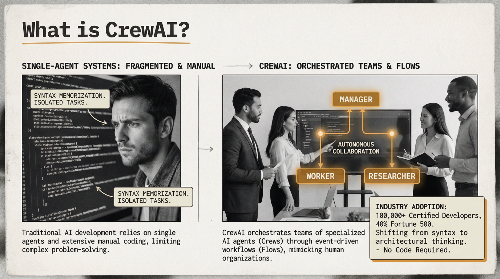
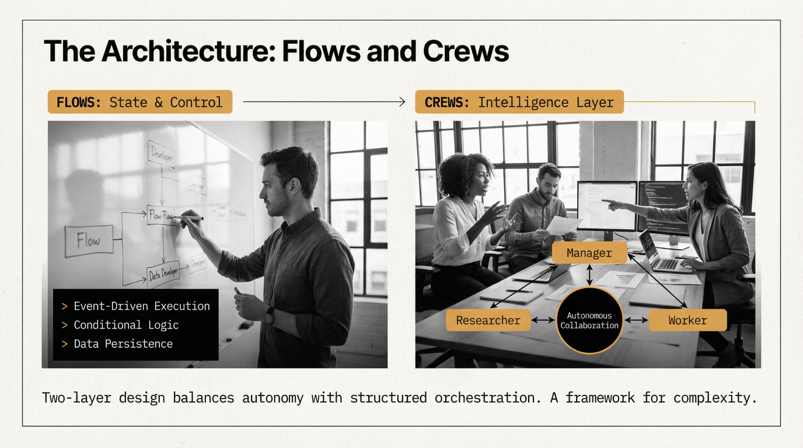
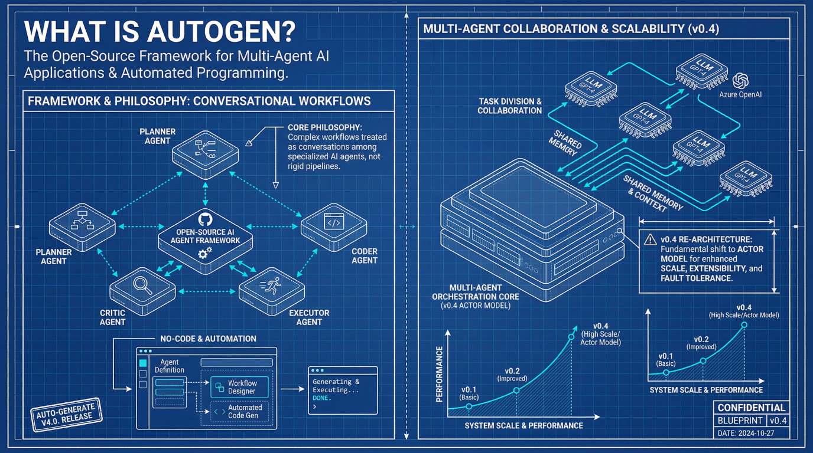
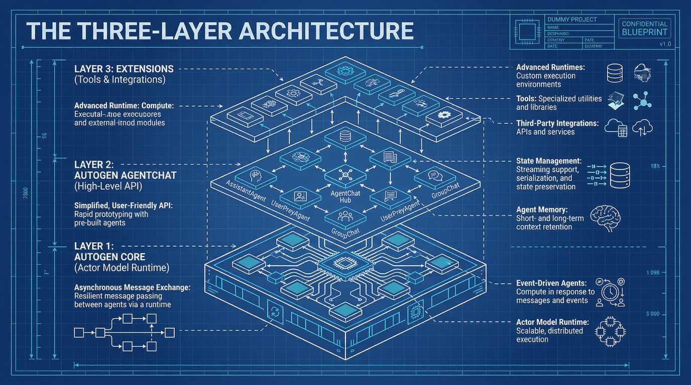
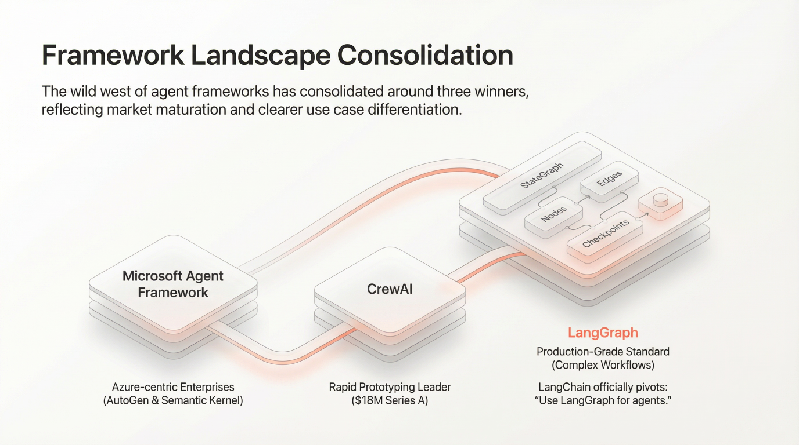
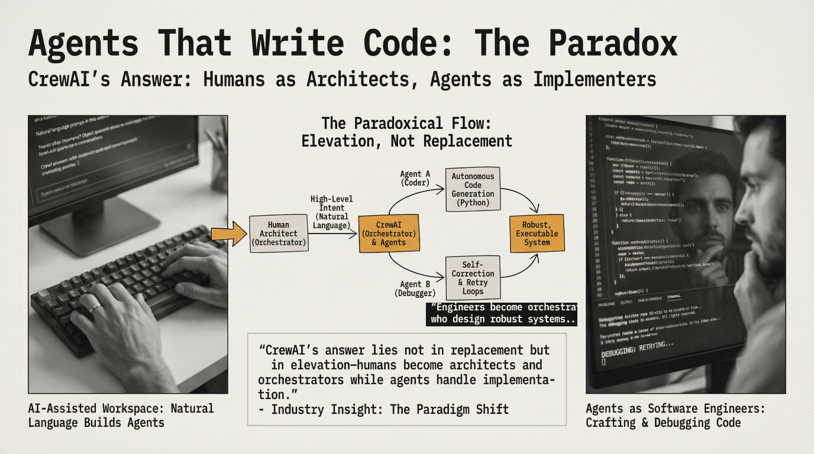

# 为什么需要 MoFA

### 在 LangGraph、CrewAI、AutoGen 及其他 Agent 框架之后

> GSoC 2026 提案征集 — 批判性分析方向

---

## 1. 引言与挑战：理解现有格局

本文件夹包含三份深度分析演示文稿，分别剖析了当前主流的 AI Agent 框架。**我们强烈建议你在撰写提案之前仔细研读这三份材料。** 它们不是营销材料——而是对每个框架的优势、缺陷以及市场走向的批判性分析。

### LangGraph：基于图的生产级标准

**"LangGraph: The Evolution of AI Agent Orchestration"**（`LangGraph_ The Evolution of AI Agent Orchestration.pptx`）

  

LangGraph 是一个基于图的编排框架，用于构建复杂的、有状态的多 Agent AI 工作流。作为 LangChain 生态系统的一部分，月下载量超过 617 万次，它使用有向图——以节点表示动作、边表示流程控制——支持分支、循环和持久状态管理。它将自身定位为 AI Agent 互操作的"USB-C 万能连接器"。

来自演示文稿的关键观察：
- LangGraph 主导生产级 Agent 框架领域，在 Klarna、Replit 和 Elastic 均有部署
- 框架格局已整合为三大赢家：LangGraph（生产级标准）、CrewAI（快速原型开发）和 Microsoft Agent Framework（企业级）
- LangGraph 对 vibe coding 的战略回应："用 Vibe 做原型，用 LangGraph 做生产"
- LangGraph Studio 提供可视化调试和编排
- Vibe coding 的隐性成本——初始 3-5 倍的速度提升在两个月后消退，静态分析警告增加 30%，代码复杂度上升 41%

### CrewAI：多 Agent 编排平台

**"CrewAI: Orchestrating the Future of AI-Driven Development"**（`CrewAI_ Orchestrating the Future of AI-Driven Development.pptx`）

  

CrewAI 将 AI Agent 组织成带有角色（经理、研究员、工人）的编排团队，从语法级编码转向架构思维。拥有超过 10 万名认证开发者和基于 CrewAI Studio 的无代码能力，它开创了"vibe coding"范式——用自然语言在几分钟内构建生产就绪的工作流。

  

关键观察：
- 两层架构：Flows（事件驱动执行、条件逻辑、数据持久化）和 Crews（带有角色 Agent 的智能层）
- "无代码"革命——自然语言输入到生产 Agent，支持 Python 代码导出进行自定义
- 编写代码的 Agent 的悖论："CrewAI 的答案不在于替代，而在于提升——人类成为架构师和编排者，而 Agent 负责实现"
- 通过人类反馈循环训练 Agent，无需编程（`crewai train -n <iterations>`）
- 企业采用：遗留系统现代化速度提升 70%，后台自动化时间缩短 75%

### 微软 AutoGen：企业级多 Agent 框架

**"Microsoft AutoGen: The AI Agent Framework Revolutionizing Software Development"**（`Microsoft AutoGen_ The AI Agent Framework Revolutionizing Software Development.pptx`）

  

AutoGen 是微软的开源框架，用于多 Agent AI 应用和自动化编程。它具有三层架构（Core → AgentChat → Extensions）、对话式工作流以及在沙箱容器中自动生成和执行代码的能力。

  

关键观察：
- 三层架构以复杂度为代价提供灵活性
- AutoGen Studio 提供无代码可视化构建，但与微软生态系统紧密耦合
- 自动代码生成配合基于 Docker 的沙箱执行
- 战略融合：AutoGen + Semantic Kernel → 统一微软 Agent 框架（预计 2026 年）
- 企业成果：Agent 效率提升 73%，成本降低 24%，但存在严重的微软锁定
- 人在回路作为核心设计原则，而非事后补充

---

## 2. 为什么我们还需要另一个 Agent 框架——三大框架未能解决的问题

在研究了 LangGraph、CrewAI 和 AutoGen 之后，一个自然的问题浮现：**为什么还要费力构建 MoFA？** 市场上已经有资金充裕、广泛采用的框架了。以下是我们对差距的诚实评估。

  

### 差距 1：厂商锁定与封闭生态问题

LangGraph 与 LangChain 不可分割。AutoGen 正在与 Semantic Kernel 一起融合进微软的专有 Agent 平台。CrewAI 虽然更独立，但仍主要围绕 OpenAI 兼容 API 设计。**它们在系统层面都不是真正的模型无关或基础设施无关的。** 当你的 Agent 框架是一家以销售 API 为商业模式的公司的产品时，框架总会为该 API 进行优化——而不是为你的用例。

MoFA 的立场：一个开源的、社区治理的框架，没有商业 API 可卖。框架应该服务于开发者，而不是商业模式。

  

### 差距 2：边缘和端侧的盲区

三大主流框架都假设云优先部署。LangGraph 的生产方案是 LangSmith（云端）。AutoGen 的执行沙箱是 Docker 容器。CrewAI 的扩展方案是云端编排。**它们都没有认真对待端侧优先、边缘优先的推理。**

在一台拥有 Apple Silicon 统一内存的 16GB MacBook 上，你不需要通过 HTTP 调用 Ollama 或 OpenAI。你需要的是直接的 Rust 级推理调用，在模型之间进行零拷贝张量传递。这是一个根本不同的架构假设——而 MoFA 正处于独特的位置来探索这一方向（参见 [Idea 3: 边缘模型调度器](../../ideas-list.md)）。

### 差距 3：调试和可观测性的荒漠

LangGraph 有 LangSmith 用于追踪。AutoGen 有 AutoGen Studio 用于可视化构建。CrewAI 有基本的日志记录。但**它们都没有为多 Agent 系统提供真正的时间旅行调试。** 当一个 5-Agent 管道间歇性失败时，开发者只能阅读日志文件。目前没有"Agent 版的 Chrome DevTools"——无法暂停、逐步执行、检查状态并修改后重放。

这不是锦上添花；而是生产环境采用的前提条件。MoFA 的[会话记录器与可视化调试器（Idea 4）](../../ideas-list.md)旨在将此打造为一流能力。

### 差距 4：组合问题

  

CrewAI 的团队隐喻（经理、研究员、工人）直观但僵化。LangGraph 的图模型灵活但需要深厚的专业知识。AutoGen 的对话式方法自然但在规模化时难以控制。**它们都没有解决根本问题：如何将不同开发者用不同假设构建的 Agent 组合成一个可靠的系统？**

在 vibe coding 时代，这变得至关重要。三个开发者各自用 vibe coding 方式编写一个组件。谁来确保它们能协同工作？当前的框架将这个问题推给了开发者。MoFA 的目标是让组合成为框架的职责。

### 差距 5：性能与系统级思维

LangGraph、CrewAI 和 AutoGen 都是 Python 框架。它们继承了 Python 的性能特征：GIL 限制、高内存开销和缓慢的启动速度。对于 CLI 工具、桌面应用或边缘设备，**Python 是错误的底层选择。** MoFA 押注 Rust 不是语言部落主义——而是为了构建一个能在任何地方运行的框架，从 MacBook 到树莓派，都有可预测的性能。

### 差距 6：框架哲学 vs. API 封装

  

大多数"Agent 框架"实际上是 **API 封装库**——它们使调用 LLM 和链接输出变得方便。一个真正的框架提供控制反转：框架调用你的代码，而不是反过来。它管理生命周期、强制执行契约、处理错误并提供保证。**Agent 框架领域充斥着伪装成框架的库。** MoFA 的目标是成为一个真正的框架——对 Agent 应该如何构建、组合和运行有明确的主张。

---

## 3. 提案征集——我们想要你的批判性思考

我们不要求你无条件接受上述论点。事实上，我们希望你能挑战它们。

### 我们在寻找什么

- **真诚的分析，而非摇旗呐喊。** 如果你认为 LangGraph 已经很好地解决了组合问题，请论证它。如果你认为 MoFA 押注 Rust 是错误的，告诉我们为什么。我们想要反映真实思考的提案。
- **实验精神。** 用 LangGraph、CrewAI 或 AutoGen 构建一个小项目。然后尝试用 MoFA 构建相同的东西。记录什么容易、什么困难、什么不可能。第一手经验胜过二手观点。
- **找出真正的差距。** 上述六个差距是我们的视角。你可能发现不同的差距。你可能发现我们声称的某些差距在实践中并不重要。你的提案应该表明立场。
- **提出具体的贡献。** 在分析之后，MoFA 应该怎么做？这可以是一份设计文档、一个原型、一个基准测试、一个新架构——或者一个 MoFA 应该彻底改变方向的论证。

### 建议的方法

1. **深度对比**：选择一个差距（如调试、组合、边缘部署）。在两三个框架上构建相同的 Agent 系统。记录开发体验、性能和失败模式。
2. **架构评审**：研究 MoFA 的当前代码库（[mofa](https://github.com/mofa-org/mofa)）。找出架构在哪些方面支持或矛盾上述主张。提出具体的改进方案。
3. **差距验证**：选择六个差距之一，尝试反驳它。你能在 LangGraph 中构建生产级的调试体验吗？你能让 CrewAI 在边缘设备上高效运行吗？展示你的工作。
4. **发现新差距**：通过你自己使用 Agent 框架的经验，找出我们没有列出的问题。提出 MoFA 应该如何解决。

### 如何开始

1. **研究演示文稿**——本文件夹中的三份材料。做笔记，形成观点。
2. **亲自尝试框架。** 安装 LangGraph、CrewAI 和/或 AutoGen。构建一些真实的东西。不要只停留在教程。
3. **克隆并构建 MoFA**（[mofa](https://github.com/mofa-org/mofa)）。运行示例。了解它目前的状态。
4. **阅读[项目创意列表](../../ideas-list.md)**和[框架方向 CFP](../framework-for-ai/call-for-proposal.md)。理解全貌。
5. **加入社区讨论**——在 [Discord](https://discord.gg/hKJZzDMMm9) 上。问尖锐的问题，挑战既有假设。
6. **撰写一份我们能从中学习的提案**——无论你是否被选中。

### 关于诚实的说明

MoFA 还很早期。我们的 Rust 代码库还年轻。我们没有 LangGraph 的 600 万月下载量，也没有微软的企业级支撑。我们是一个小团队，对 Agent 框架应该是什么样子有自己的论点。如果你加入我们，你将从更接近零的起点开始构建——这意味着你的想法将产生超乎寻常的影响。但这也意味着你将面对真正的不确定性。

我们认为这很令人兴奋。希望你也这么认为。

---

*MoFA 是 MIT/Apache-2.0 许可证下的开源项目。*
*组织联系方式：dev@mofa.ai | Discord：https://discord.gg/hKJZzDMMm9*
